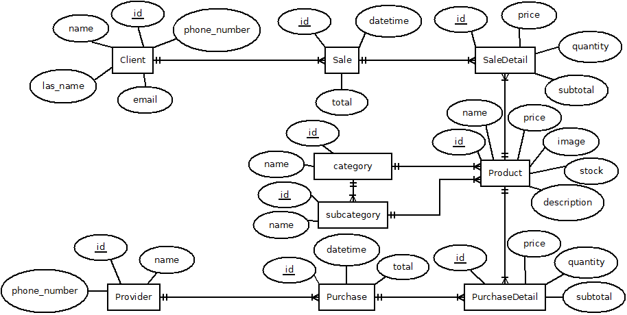

# SWGCV-backend

Backend para Sistema Web de Gestión Comercial para Vivero

## Configuración del proyecto

- Crear un archivo `.env` con lo siguiente:

```
# Config

SECRET_KEY=<your-secret-key>
DEBUG=True
CORS_ALLOWED_ORIGINS=http://localhost:3000,http://localhost:3001

# SERVERS

SERVER=http://127.0.0.1:8000/
ADMIN_SERVER=http://localhost:3000/
CLIENT_SERVER=http://localhost:3001/

# Database

NAME_DB=<database-name>
USER=root
PASSWORD=<your-password>
HOST=127.0.0.1
PORT=3306

# Email

EMAIL_HOST_USER=<your-host-user>
EMAIL_HOST=smtp.gmail.com
EMAIL_PORT=587
EMAIL_HOST_PASSWORD=<your-password>
EMAIL_USE_TLS=True
```

- Crea la base de datos en MySQL con el nombre que pusiste en `NAME_DB`

- Crea y ejecuta las migraciones

```bash
python manage.py makemigrations & python manage.py migrate
```

## Modelado de datos

### product

- id (UNIQUE): **INTEGER** **(PK)**
- name (UNIQUE): **VARCHAR (100)**
- description: **TEXT**
- price: **FLOAT**
- stock: **INTEGER**
- image: **VARCHAR (20)**
- category_id: **INTEGER** **(FK)** R: 1 -> 1
- subcategory_id: **INTEGER** **(FK)** R: 1 -> 1

### product_category **(Catálogo)**

- id (UNIQUE): **INTEGER** **(PK)**
- name (UNIQUE): **VARCHAR (100)**

### product_subcategory **(Catálogo)**

- id (UNIQUE): **INTEGER** **(PK)**
- category_id: **INTEGER** **(FK)** R: 1 -> 1
- name (UNIQUE): **VARCHAR (100)**

### client

- id (UNIQUE): **INTEGER** **PK**
- name: **VARCHAR (50)**
- last_name: **VARCHAR (50)**
- password: **VARCHAR (256)**
- email: **VARCHAR (256)**
- phone_number: **VARCHAR (9)**

### sale

- id (UNIQUE):: **INTEGER** **PK**
- datetime: **DATETIME**
- id_client: **INTEGER** **FK**
- total: **FLOAT**

### sale_detail

- id (UNIQUE):: **INTEGER** **PK**
- id_sale: **INTEGER** **FK**
- id_product: **INTEGER** **FK**
- quantity: **FLOAT**
- price: **FLOAT**
- subtotal: **FLOAT**

### provider

- id (UNIQUE): **INTEGER** **PK**
- name: **VARCHAR (50)**
- phone_number: **VARCHAR (9)**

### purchase

- id (UNIQUE): **INTEGER** **PK**
- datetime: **DATETIME**
- id_provider: **INTEGER** **FK**
- total: **FLOAT**

### purchase_detail

- id (UNIQUE):: **INTEGER** **PK**
- id_purchase: **INTEGER** **FK**
- id_product: **INTEGER** **FK**
- quantity: **FLOAT**
- price: **FLOAT**
- subtotal: **FLOAT**

## Diagrama entidad relación


